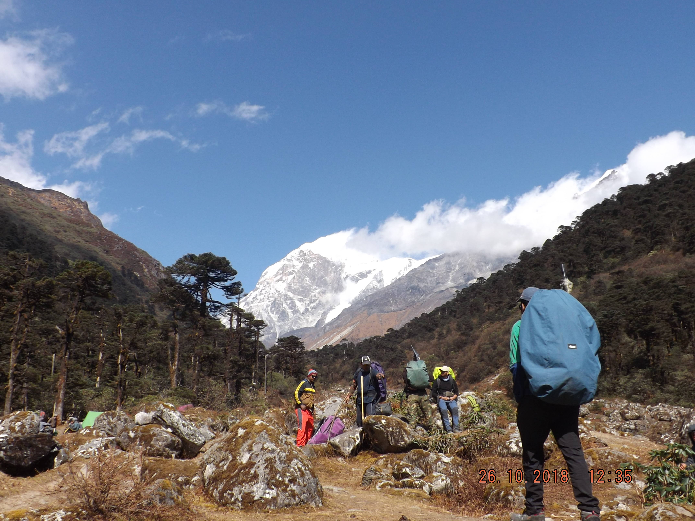

It snowed heavily that night, I closed my eyes and heard the faint clanging of bells tied around a yak's neck. The wind howled outside, and I could hear the kitchen tent flapping. The more experienced teammates assured me that all would be well the next morning. I tried to stay awake but soon fell into a slumber, that night I dreamt us making our way through a dense jungle that never seemed to end.

> Ten indomitable members of the **Berhampur Adventure Club (BAC)** from Murshidabad, West Bengal venture out to an unknown and sacred place of Sikkim named **Yangiotak**, adjacent to the **Talung glacier**. What happens next ? *Continue reading to find out!*

## Dzongri to Thansing

The following morning, we set off for **Thansing**, awesome weather allowed full view of the mountains around. On the way a long descent led us to the river Prek chu, the place is known as *Khokchurang*. The team took a break, I was too tired to move, and so laid down my ruksack and opened my shoes and socks. Legs stretched out, I sat on the grassy river bed of Khokchurang under the sun. A small trekker's hut on my right, a river gushing by my left and dense forest on the opposite bank makes up the cozy little place. After a tiring trek from Dzongri, the short break made me feel sleepy, the soft grass, the warmth of the sun, felt heavenly. We left Khokchurang after the stopover, crossed the river, negotiated a boulder zone and entered the thick forest. As we made our way further in, all the noise subsided, the crashing of the river ebbed away; the pine trees with their mossy overgrown branches blocked out the sunlight. It felt as if we were walking on an alien planet, where the inhabitants were shy and never showed up, but they watched us closely. The last leg of the trek for that day was a long and gradual ascent on the jungle trail by the river to Thansing.

*Campsite a Dzongri valley, yak huts visible in the distance*

The route from Dzongri to Khokchurang, descends steeply into a gorge. As the elevation changes, the weather becomes warmer. While Dzongri had no vegetation other than rhododendron shrubs, khokchurang was surrounded by dense pine forests. As we climbed higher once again, a chilly wind rushed in rattling the tree branches. Lack of sunlight immediately made the place colder, and our hands were numb often. As we approached Thansing, the vegetation gradually receded and the temperature dipped, idle hands soon became numb and it was increasingly difficult to negotiate the treacherous terrain.

*On our way to Thansing from Khokchurang*

Thansing is a massive, undulated valley at an altitude of *12,900 ft.* with almost no vegetations other than some juniper, rhododendron and thorny shrubs. The valley with the river by one side stretches for miles up to *Lamuney*, surrounded by several snow-clad peaks. By 4:00 P.M. we reached Thansing, it turned very windy and the weather went south. There was a yak hut in Thansing and a few other teams camping. Temperature nosedived by the time we set up our tents, the wind chill made it worse. We layered up as we watched the sun setting over the valley, and sipped hot tea. Dinner was cooked and we retired early after a glorious albeit tiring day.

*To be continued...*
